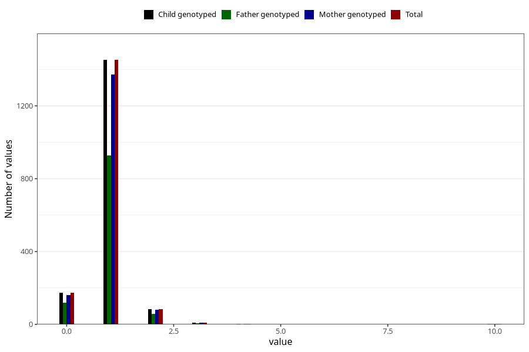

# accident_injury_number_6_11m
Variable mapping to `EE266` in `Skjema5_18mnd_v12`.
- Number of values:

| Value | Total | Child genotyped | Mother genotyped | Father genotyped |
| ----- | ----- | --------------- | ---------------- | ---------------- |
| Missing | 79281 | 79281 | 74986 | 52490 |
| Non-missing | 1724 | 1724 | 1631 | 1114 |
| 0 | 172 | 172 | 162 | 119 |
| 1 | 1452 | 1452 | 1373 | 928 |
| 2 | 84 | 84 | 80 | 57 |
| 3 | 9 | 9 | 9 | 7 |
| 4 | 2 | 2 | 2 | 0 |
| 6 | 1 | 1 | 1 | 0 |
| 7 | 1 | 1 | 1 | 0 |
| 9 | 1 | 1 | 1 | 1 |
| 10 | 2 | 2 | 2 | 2 |

