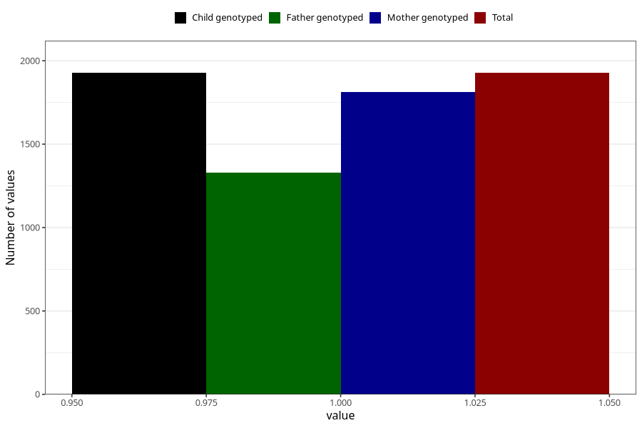

# accidental_injury_with_subsequent_medical_treatment_8y
Variable mapping to `NN32` in `Skjema8aar_v12`.
- Number of values:

| Value | Total | Child genotyped | Mother genotyped | Father genotyped |
| ----- | ----- | --------------- | ---------------- | ---------------- |
| Missing | 79078 | 79078 | 74803 | 52276 |
| Non-missing | 1927 | 1927 | 1814 | 1328 |
| 1 | 1927 | 1927 | 1814 | 1328 |

