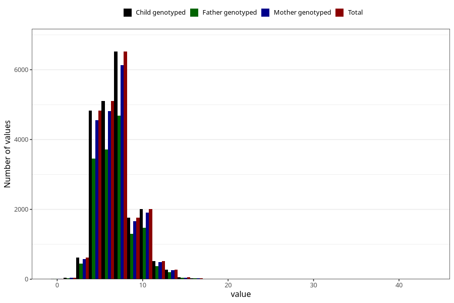

# age_first_tooth
Variable mapping to `EE1012` in `Skjema5_18mnd_v12`.
- Number of values:

| Value | Total | Child genotyped | Mother genotyped | Father genotyped |
| ----- | ----- | --------------- | ---------------- | ---------------- |
| Missing | 59237 | 59237 | 56109 | 37868 |
| Non-missing | 21768 | 21768 | 20508 | 15736 |
| 25th percentile | 5 | 5 | 5 | 5 |
| 50th percentile | 7 | 7 | 7 | 7 |
| 75th percentile | 8 | 8 | 8 | 8 |
| Mean | 6.95295847115031 | 6.95295847115031 | 6.94480202847669 | 6.95570665988815 |
| Standard deviation | 2.25807514527647 | 2.25807514527647 | 2.23932060688681 | 2.2451321142602 |
| N | 21768 | 21768 | 20508 | 15736 |

