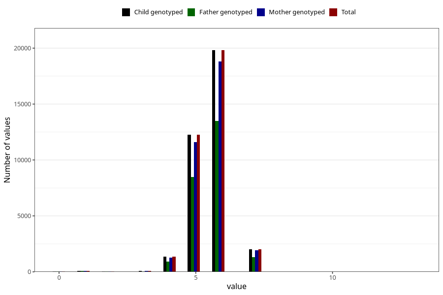

# age_lost_first_tooth_years
Variable mapping to `JJ332` in `Skjema7aar_v12`.
- Number of values:

| Value | Total | Child genotyped | Mother genotyped | Father genotyped |
| ----- | ----- | --------------- | ---------------- | ---------------- |
| Missing | 45274 | 45274 | 42773 | 29212 |
| Non-missing | 35731 | 35731 | 33844 | 24392 |
| 0 | 52 | 52 | 50 | 34 |
| 1 | 96 | 96 | 90 | 62 |
| 2 | 30 | 30 | 28 | 21 |
| 3 | 89 | 89 | 81 | 56 |
| 4 | 1365 | 1365 | 1278 | 924 |
| 5 | 12251 | 12251 | 11596 | 8457 |
| 6 | 19810 | 19810 | 18789 | 13510 |
| 7 | 2036 | 2036 | 1930 | 1328 |
| 8 | 1 | 1 | 1 | 0 |
| 13 | 1 | 1 | 1 | 0 |

