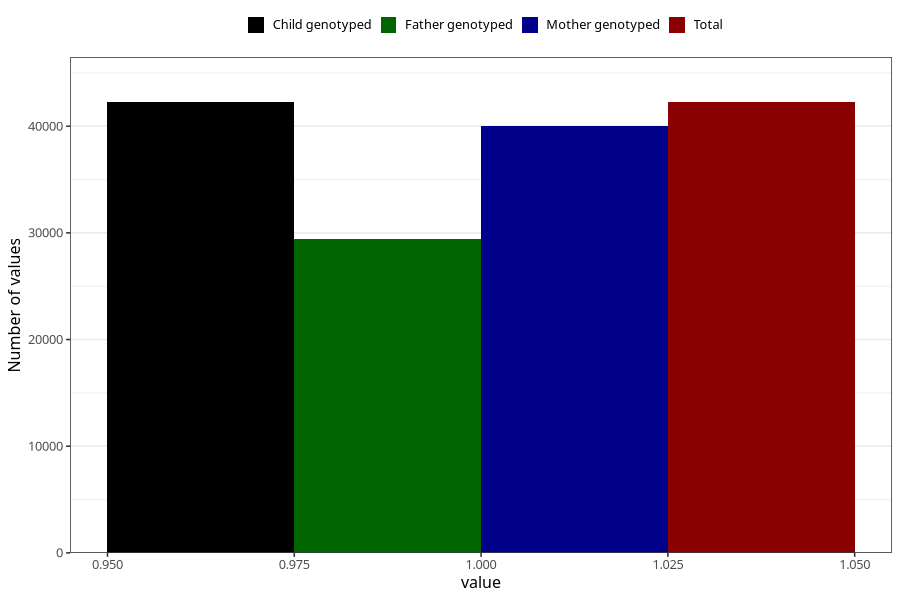

# allergy_affecing_eyes_nose_no_3y
Variable mapping to `GG73` in `Skjema6_3aar_v12`.
- Number of values:

| Value | Total | Child genotyped | Mother genotyped | Father genotyped |
| ----- | ----- | --------------- | ---------------- | ---------------- |
| Missing | 38756 | 38756 | 36646 | 24225 |
| Non-missing | 42249 | 42249 | 39971 | 29379 |
| 1 | 42249 | 42249 | 39971 | 29379 |

