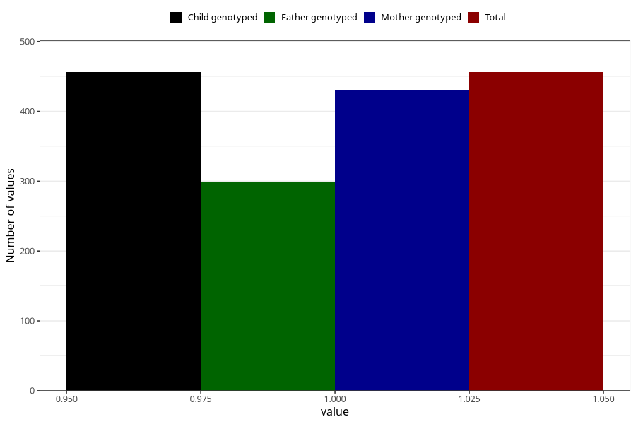

# allergy_affecing_eyes_nose_previous_3y
Variable mapping to `GG75` in `Skjema6_3aar_v12`.
- Number of values:

| Value | Total | Child genotyped | Mother genotyped | Father genotyped |
| ----- | ----- | --------------- | ---------------- | ---------------- |
| Missing | 80549 | 80549 | 76186 | 53306 |
| Non-missing | 456 | 456 | 431 | 298 |
| 1 | 456 | 456 | 431 | 298 |

