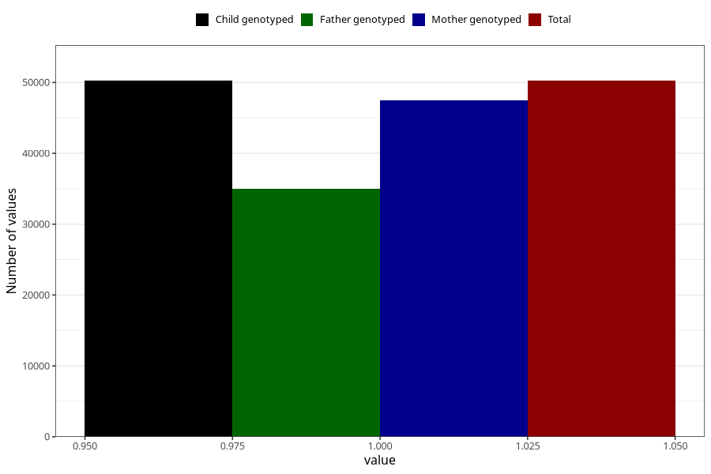

# asthma_no_18m
Variable mapping to `EE823` in `Skjema5_18mnd_v12`.
- Number of values:

| Value | Total | Child genotyped | Mother genotyped | Father genotyped |
| ----- | ----- | --------------- | ---------------- | ---------------- |
| Missing | 30764 | 30764 | 29091 | 18597 |
| Non-missing | 50241 | 50241 | 47526 | 35007 |
| 1 | 50241 | 50241 | 47526 | 35007 |

