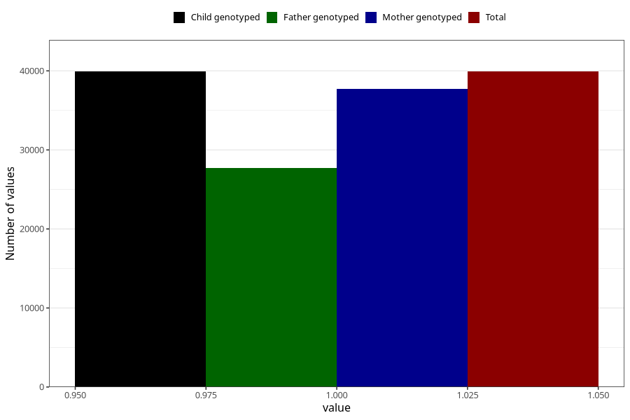

# asthma_no_3y
Variable mapping to `GG69` in `Skjema6_3aar_v12`.
- Number of values:

| Value | Total | Child genotyped | Mother genotyped | Father genotyped |
| ----- | ----- | --------------- | ---------------- | ---------------- |
| Missing | 41089 | 41089 | 38856 | 25924 |
| Non-missing | 39916 | 39916 | 37761 | 27680 |
| 1 | 39916 | 39916 | 37761 | 27680 |

