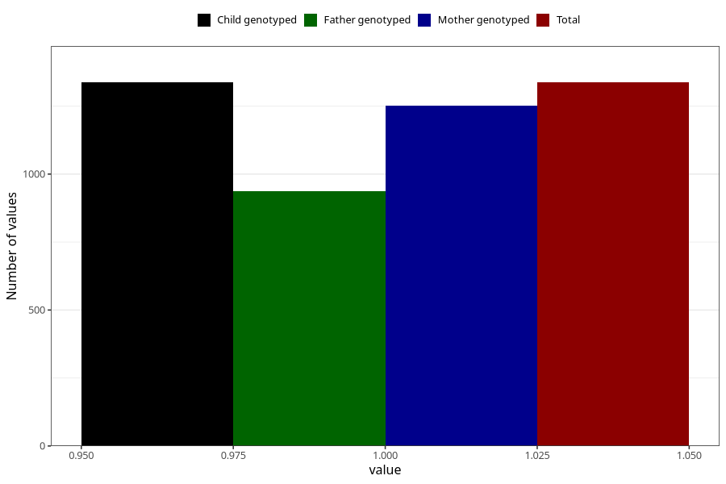

# asthma_previous_3y
Variable mapping to `GG71` in `Skjema6_3aar_v12`.
- Number of values:

| Value | Total | Child genotyped | Mother genotyped | Father genotyped |
| ----- | ----- | --------------- | ---------------- | ---------------- |
| Missing | 79668 | 79668 | 75366 | 52668 |
| Non-missing | 1337 | 1337 | 1251 | 936 |
| 1 | 1337 | 1337 | 1251 | 936 |

