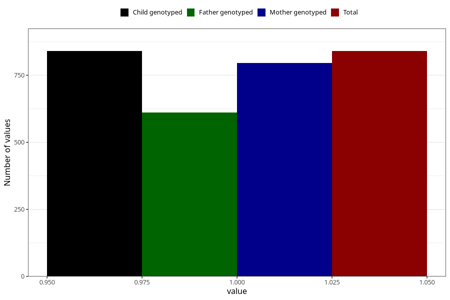

# asthma_previously_18m
Variable mapping to `EE825` in `Skjema5_18mnd_v12`.
- Number of values:

| Value | Total | Child genotyped | Mother genotyped | Father genotyped |
| ----- | ----- | --------------- | ---------------- | ---------------- |
| Missing | 80165 | 80165 | 75821 | 52993 |
| Non-missing | 840 | 840 | 796 | 611 |
| 1 | 840 | 840 | 796 | 611 |

