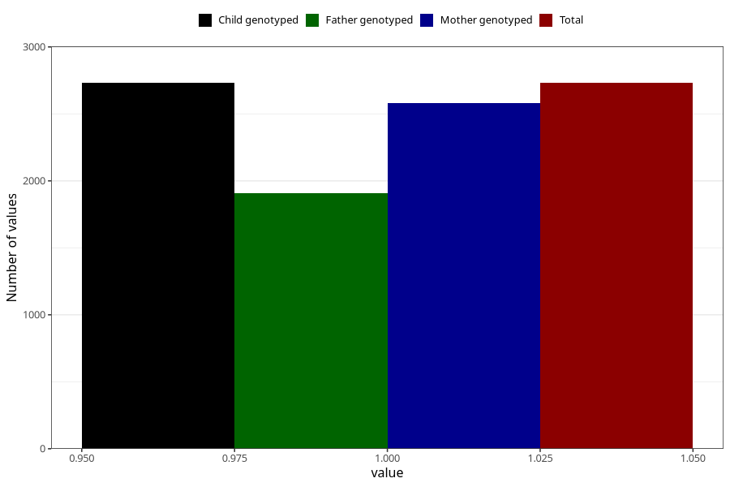

# asthma_yes_18m
Variable mapping to `EE824` in `Skjema5_18mnd_v12`.
- Number of values:

| Value | Total | Child genotyped | Mother genotyped | Father genotyped |
| ----- | ----- | --------------- | ---------------- | ---------------- |
| Missing | 78274 | 78274 | 74037 | 51694 |
| Non-missing | 2731 | 2731 | 2580 | 1910 |
| 1 | 2731 | 2731 | 2580 | 1910 |

