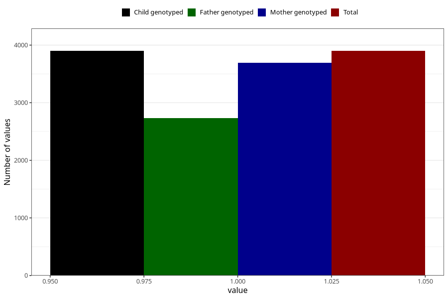

# atopic_eczema_previous_3y
Variable mapping to `GG79` in `Skjema6_3aar_v12`.
- Number of values:

| Value | Total | Child genotyped | Mother genotyped | Father genotyped |
| ----- | ----- | --------------- | ---------------- | ---------------- |
| Missing | 77106 | 77106 | 72928 | 50870 |
| Non-missing | 3899 | 3899 | 3689 | 2734 |
| 1 | 3899 | 3899 | 3689 | 2734 |

