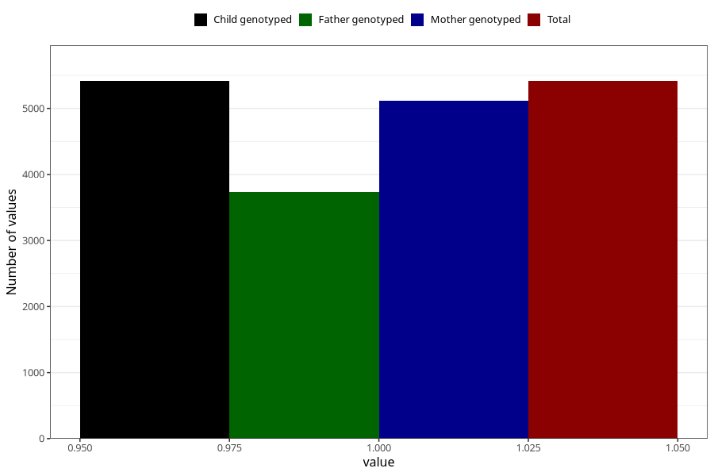

# atopic_eczema_yes_3y
Variable mapping to `GG78` in `Skjema6_3aar_v12`.
- Number of values:

| Value | Total | Child genotyped | Mother genotyped | Father genotyped |
| ----- | ----- | --------------- | ---------------- | ---------------- |
| Missing | 75591 | 75591 | 71496 | 49871 |
| Non-missing | 5414 | 5414 | 5121 | 3733 |
| 1 | 5414 | 5414 | 5121 | 3733 |

