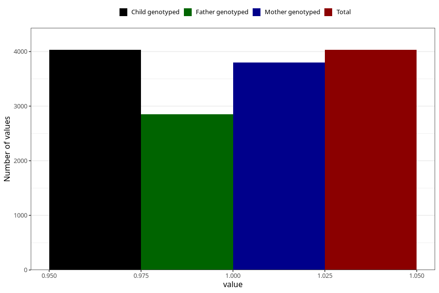

# atopic_previously_eczema_18m
Variable mapping to `EE829` in `Skjema5_18mnd_v12`.
- Number of values:

| Value | Total | Child genotyped | Mother genotyped | Father genotyped |
| ----- | ----- | --------------- | ---------------- | ---------------- |
| Missing | 76975 | 76975 | 72815 | 50757 |
| Non-missing | 4030 | 4030 | 3802 | 2847 |
| 1 | 4030 | 4030 | 3802 | 2847 |

