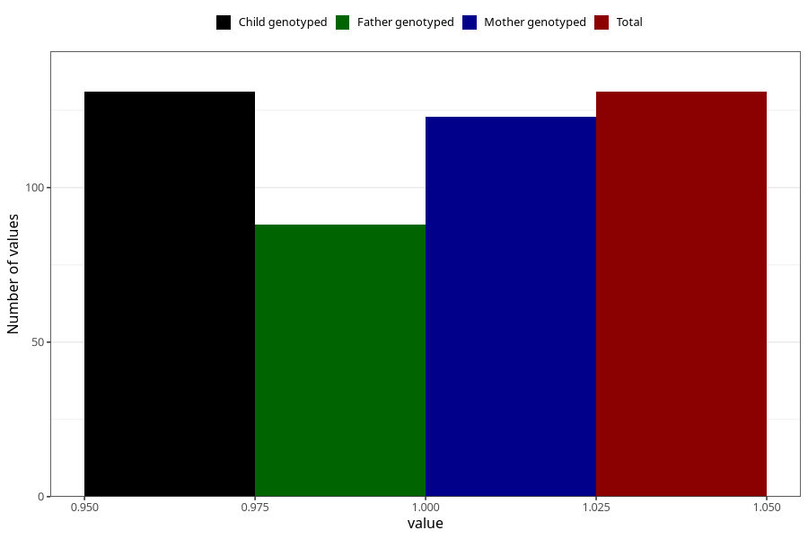

# autistic_features_autism_7y
Variable mapping to `JJ436` in `Skjema7aar_v12`.
- Number of values:

| Value | Total | Child genotyped | Mother genotyped | Father genotyped |
| ----- | ----- | --------------- | ---------------- | ---------------- |
| Missing | 80874 | 80874 | 76494 | 53516 |
| Non-missing | 131 | 131 | 123 | 88 |
| 1 | 131 | 131 | 123 | 88 |

