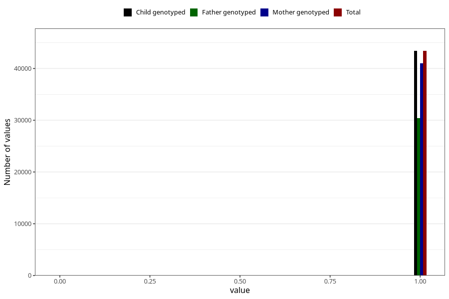

# autistic_traits_2_no_3y
Variable mapping to `GG582` in `Skjema6_3aar_v12`.
- Number of values:

| Value | Total | Child genotyped | Mother genotyped | Father genotyped |
| ----- | ----- | --------------- | ---------------- | ---------------- |
| Missing | 37589 | 37589 | 35564 | 23169 |
| Non-missing | 43416 | 43416 | 41053 | 30435 |
| 0 | 21 | 21 | 19 | 12 |
| 1 | 43395 | 43395 | 41034 | 30423 |

