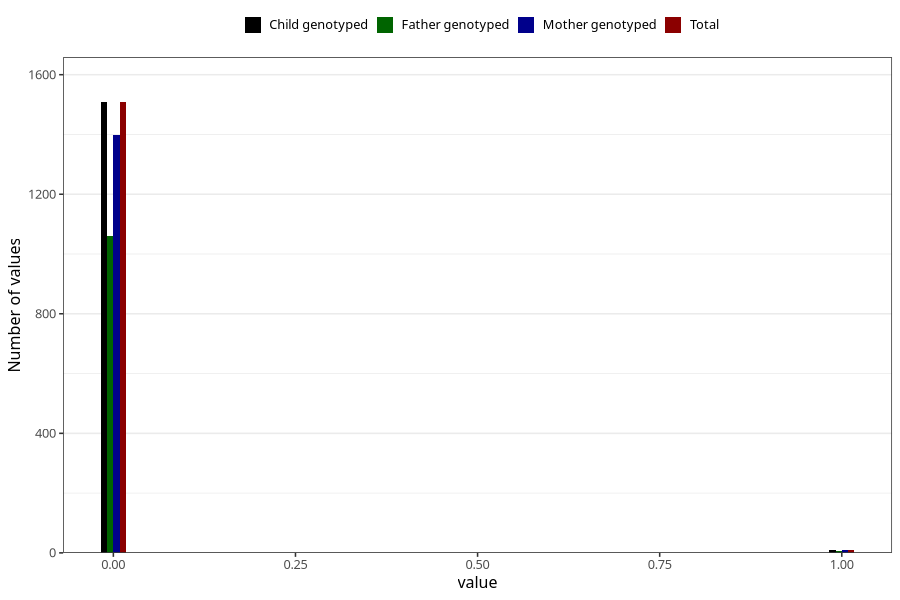

# autistic_traits_2_previous_3y
Variable mapping to `GG584` in `Skjema6_3aar_v12`.
- Number of values:

| Value | Total | Child genotyped | Mother genotyped | Father genotyped |
| ----- | ----- | --------------- | ---------------- | ---------------- |
| Missing | 79487 | 79487 | 75211 | 52538 |
| Non-missing | 1518 | 1518 | 1406 | 1066 |
| 0 | 1508 | 1508 | 1398 | 1060 |
| 1 | 10 | 10 | 8 | 6 |

