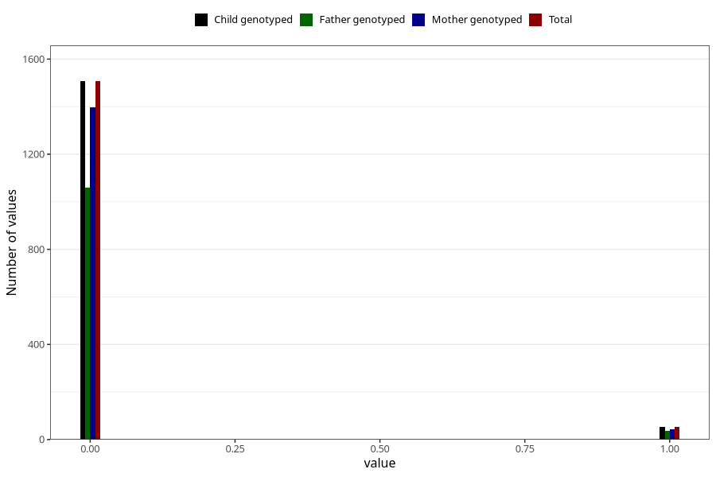

# autistic_traits_2_yes_3y
Variable mapping to `GG583` in `Skjema6_3aar_v12`.
- Number of values:

| Value | Total | Child genotyped | Mother genotyped | Father genotyped |
| ----- | ----- | --------------- | ---------------- | ---------------- |
| Missing | 79445 | 79445 | 75177 | 52510 |
| Non-missing | 1560 | 1560 | 1440 | 1094 |
| 0 | 1507 | 1507 | 1398 | 1059 |
| 1 | 53 | 53 | 42 | 35 |

