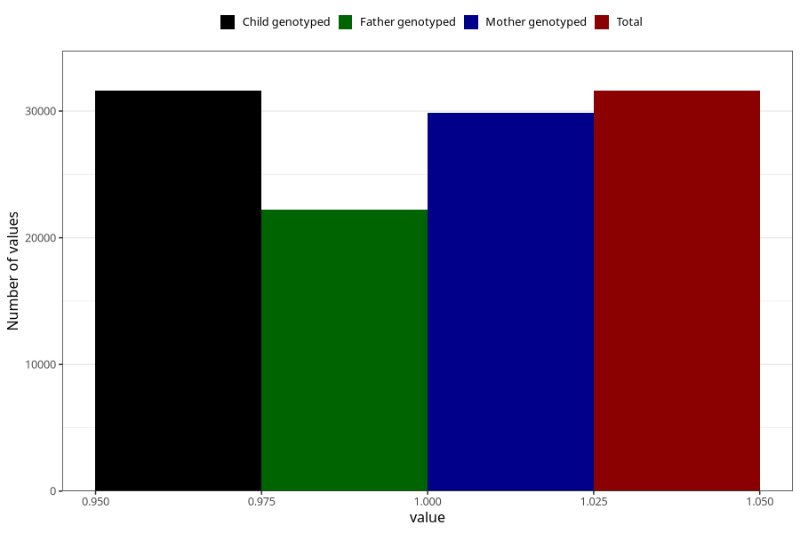

# autistic_traits_autism_Aspergers_syndrome_no_8y
Variable mapping to `NN52` in `Skjema8aar_v12`.
- Number of values:

| Value | Total | Child genotyped | Mother genotyped | Father genotyped |
| ----- | ----- | --------------- | ---------------- | ---------------- |
| Missing | 49403 | 49403 | 46772 | 31355 |
| Non-missing | 31602 | 31602 | 29845 | 22249 |
| 1 | 31602 | 31602 | 29845 | 22249 |

