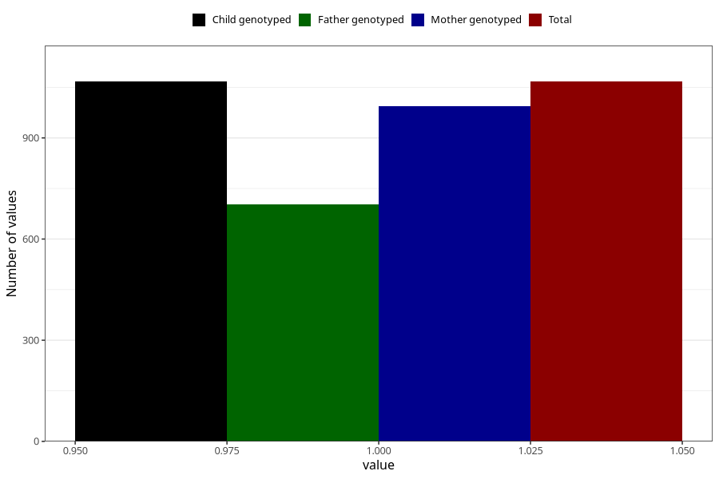

# behavioral_problems_difficult_and_unruly_currently_8y
Variable mapping to `NN57` in `Skjema8aar_v12`.
- Number of values:

| Value | Total | Child genotyped | Mother genotyped | Father genotyped |
| ----- | ----- | --------------- | ---------------- | ---------------- |
| Missing | 79938 | 79938 | 75624 | 52902 |
| Non-missing | 1067 | 1067 | 993 | 702 |
| 1 | 1067 | 1067 | 993 | 702 |

