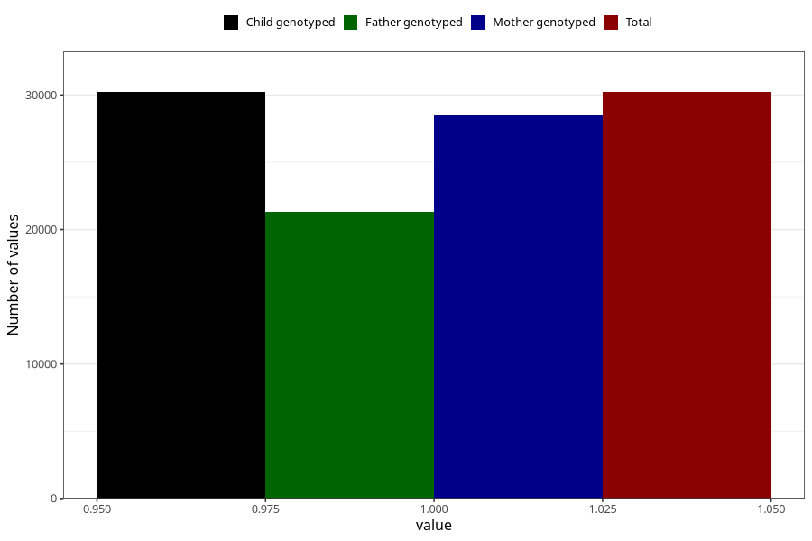

# behavioral_problems_difficult_and_unruly_no_8y
Variable mapping to `NN56` in `Skjema8aar_v12`.
- Number of values:

| Value | Total | Child genotyped | Mother genotyped | Father genotyped |
| ----- | ----- | --------------- | ---------------- | ---------------- |
| Missing | 50792 | 50792 | 48072 | 32280 |
| Non-missing | 30213 | 30213 | 28545 | 21324 |
| 1 | 30213 | 30213 | 28545 | 21324 |

