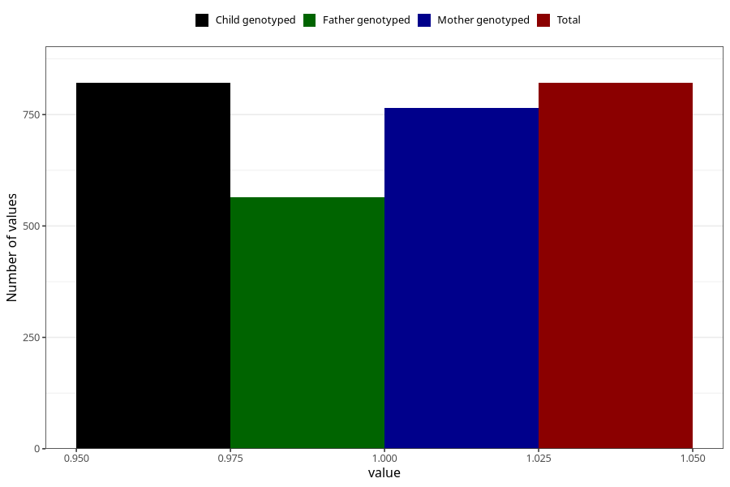

# behavioral_problems_difficult_and_unruly_past_8y
Variable mapping to `NN58` in `Skjema8aar_v12`.
- Number of values:

| Value | Total | Child genotyped | Mother genotyped | Father genotyped |
| ----- | ----- | --------------- | ---------------- | ---------------- |
| Missing | 80184 | 80184 | 75852 | 53040 |
| Non-missing | 821 | 821 | 765 | 564 |
| 1 | 821 | 821 | 765 | 564 |

