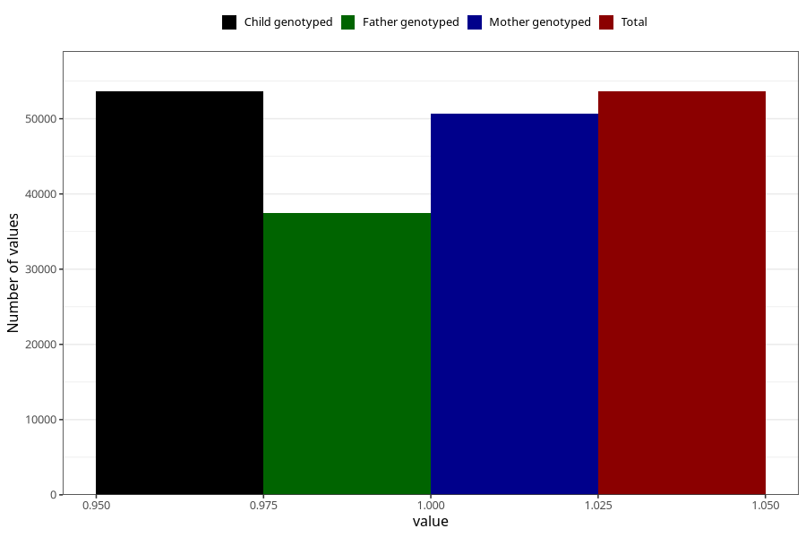

# behavioural_problems_no_18m
Variable mapping to `EE847` in `Skjema5_18mnd_v12`.
- Number of values:

| Value | Total | Child genotyped | Mother genotyped | Father genotyped |
| ----- | ----- | --------------- | ---------------- | ---------------- |
| Missing | 27383 | 27383 | 25894 | 16197 |
| Non-missing | 53622 | 53622 | 50723 | 37407 |
| 1 | 53622 | 53622 | 50723 | 37407 |

