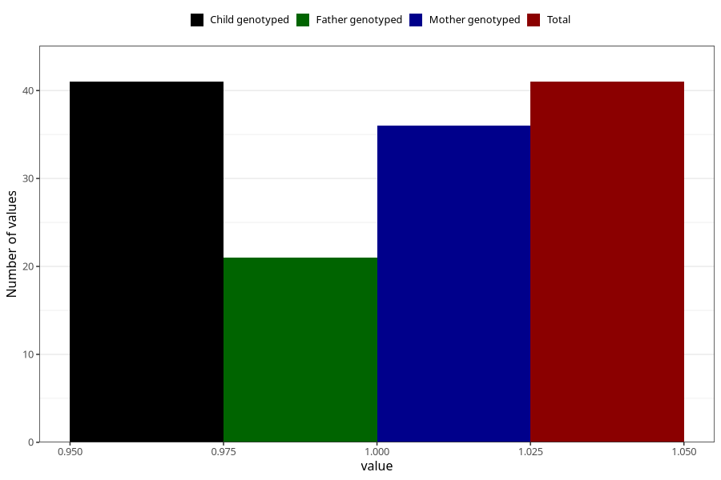

# behavioural_problems_yes_18m
Variable mapping to `EE848` in `Skjema5_18mnd_v12`.
- Number of values:

| Value | Total | Child genotyped | Mother genotyped | Father genotyped |
| ----- | ----- | --------------- | ---------------- | ---------------- |
| Missing | 80964 | 80964 | 76581 | 53583 |
| Non-missing | 41 | 41 | 36 | 21 |
| 1 | 41 | 41 | 36 | 21 |

