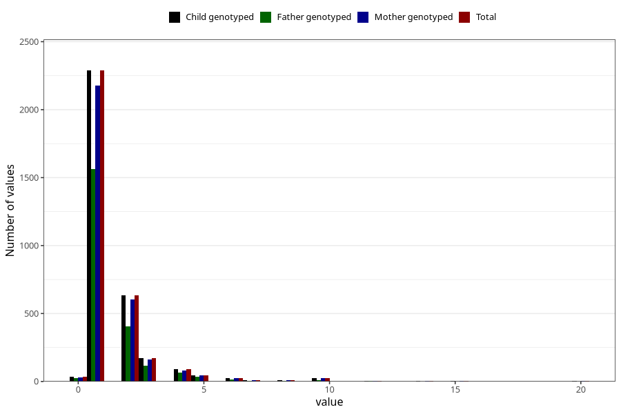

# bronchitis_freq_3y
Variable mapping to `GG144` in `Skjema6_3aar_v12`.
- Number of values:

| Value | Total | Child genotyped | Mother genotyped | Father genotyped |
| ----- | ----- | --------------- | ---------------- | ---------------- |
| Missing | 77662 | 77662 | 73440 | 51357 |
| Non-missing | 3343 | 3343 | 3177 | 2247 |
| 0 | 33 | 33 | 32 | 23 |
| 1 | 2288 | 2288 | 2175 | 1565 |
| 2 | 633 | 633 | 604 | 408 |
| 3 | 172 | 172 | 163 | 114 |
| 4 | 92 | 92 | 82 | 63 |
| 5 | 46 | 46 | 44 | 33 |
| 6 | 24 | 24 | 24 | 17 |
| 7 | 12 | 12 | 11 | 6 |
| 8 | 8 | 8 | 8 | 4 |
| 9 | 1 | 1 | 1 | 0 |
| 10 | 24 | 24 | 24 | 9 |
| 12 | 2 | 2 | 2 | 2 |
| 14 | 2 | 2 | 2 | 1 |
| 15 | 2 | 2 | 2 | 1 |
| 16 | 1 | 1 | 0 | 0 |
| 18 | 1 | 1 | 1 | 1 |
| 20 | 2 | 2 | 2 | 0 |

