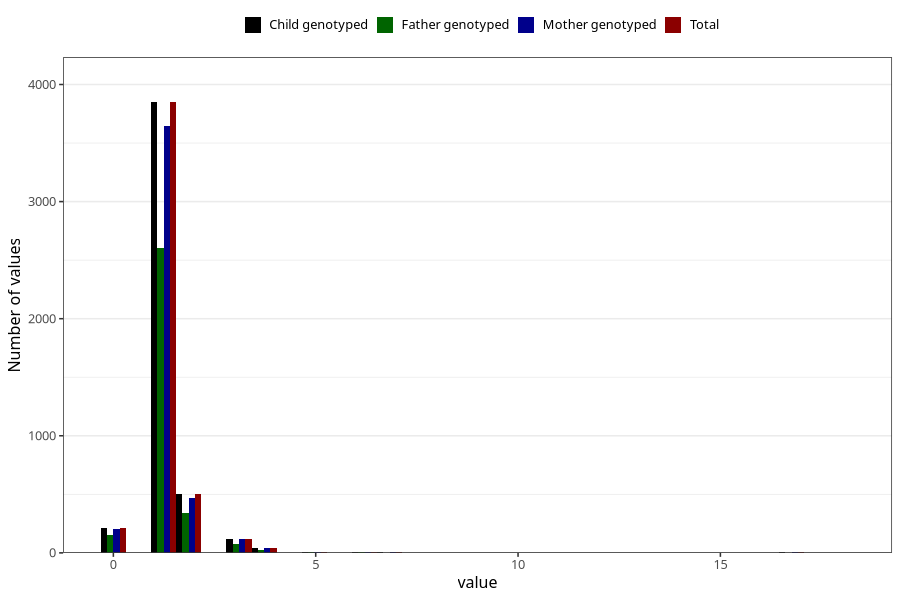

# bronchitis_rs_pneumonia_number_12_18m
Variable mapping to `EE238` in `Skjema5_18mnd_v12`.
- Number of values:

| Value | Total | Child genotyped | Mother genotyped | Father genotyped |
| ----- | ----- | --------------- | ---------------- | ---------------- |
| Missing | 76242 | 76242 | 72114 | 50387 |
| Non-missing | 4763 | 4763 | 4503 | 3217 |
| 0 | 214 | 214 | 205 | 155 |
| 1 | 3849 | 3849 | 3645 | 2601 |
| 2 | 506 | 506 | 468 | 340 |
| 3 | 117 | 117 | 115 | 76 |
| 4 | 41 | 41 | 38 | 28 |
| 5 | 10 | 10 | 10 | 4 |
| 6 | 7 | 7 | 6 | 4 |
| 7 | 5 | 5 | 4 | 3 |
| 9 | 1 | 1 | 1 | 1 |
| 10 | 3 | 3 | 3 | 2 |
| 14 | 2 | 2 | 2 | 1 |
| 16 | 1 | 1 | 1 | 0 |
| 17 | 5 | 5 | 4 | 1 |
| 18 | 2 | 2 | 1 | 1 |

