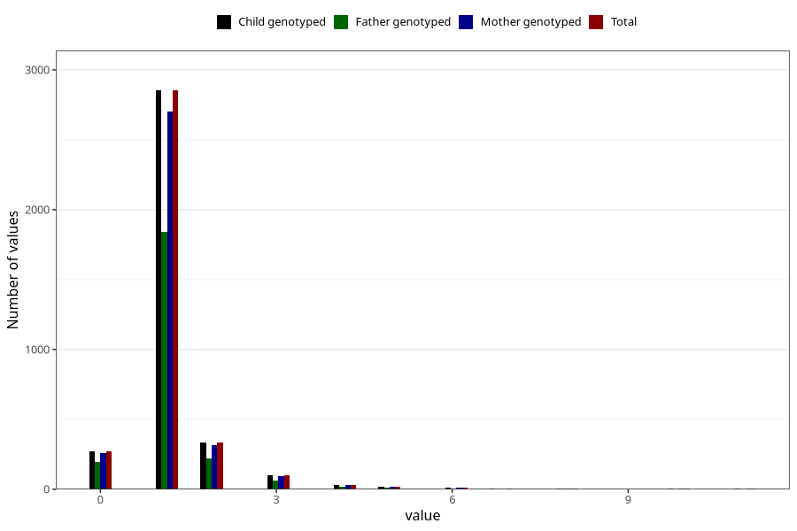

# bronchitis_rs_pneumonia_number_6_11m
Variable mapping to `EE236` in `Skjema5_18mnd_v12`.
- Number of values:

| Value | Total | Child genotyped | Mother genotyped | Father genotyped |
| ----- | ----- | --------------- | ---------------- | ---------------- |
| Missing | 77377 | 77377 | 73177 | 51244 |
| Non-missing | 3628 | 3628 | 3440 | 2360 |
| 0 | 269 | 269 | 256 | 195 |
| 1 | 2853 | 2853 | 2703 | 1844 |
| 2 | 335 | 335 | 316 | 220 |
| 3 | 98 | 98 | 94 | 63 |
| 4 | 32 | 32 | 31 | 17 |
| 5 | 18 | 18 | 18 | 12 |
| 6 | 9 | 9 | 9 | 3 |
| 7 | 3 | 3 | 2 | 0 |
| 8 | 5 | 5 | 5 | 3 |
| 10 | 3 | 3 | 3 | 1 |
| 11 | 3 | 3 | 3 | 2 |

