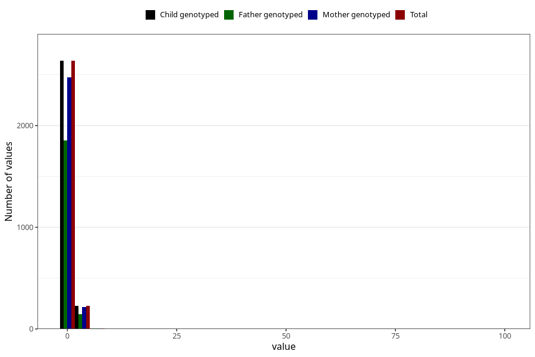

# bronchitis_rs_virus_pneumonia_freq_6m
Variable mapping to `DD280` in `Skjema4_6mnd_v12`.
- Number of values:

| Value | Total | Child genotyped | Mother genotyped | Father genotyped |
| ----- | ----- | --------------- | ---------------- | ---------------- |
| Missing | 78129 | 78129 | 73915 | 51597 |
| Non-missing | 2876 | 2876 | 2702 | 2007 |
| 0 | 87 | 87 | 83 | 64 |
| 1 | 2550 | 2550 | 2393 | 1790 |
| 2 | 172 | 172 | 163 | 112 |
| 3 | 42 | 42 | 38 | 28 |
| 4 | 8 | 8 | 8 | 4 |
| 5 | 4 | 4 | 4 | 2 |
| 6 | 3 | 3 | 3 | 1 |
| 7 | 3 | 3 | 3 | 3 |
| 8 | 1 | 1 | 1 | 0 |
| 9 | 1 | 1 | 1 | 1 |
| 10 | 1 | 1 | 1 | 0 |
| 12 | 1 | 1 | 1 | 0 |
| 14 | 1 | 1 | 1 | 0 |
| 16 | 1 | 1 | 1 | 1 |
| 99 | 1 | 1 | 1 | 1 |

