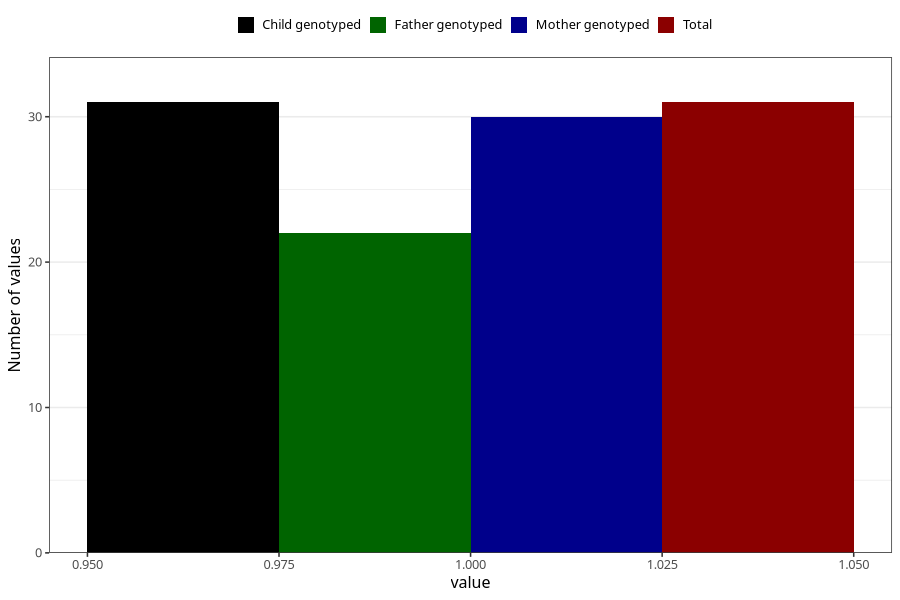

# cancer_7y
Variable mapping to `JJ428` in `Skjema7aar_v12`.
- Number of values:

| Value | Total | Child genotyped | Mother genotyped | Father genotyped |
| ----- | ----- | --------------- | ---------------- | ---------------- |
| Missing | 80974 | 80974 | 76587 | 53582 |
| Non-missing | 31 | 31 | 30 | 22 |
| 1 | 31 | 31 | 30 | 22 |

