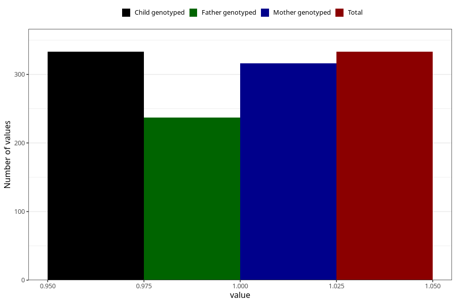

# celiac_disease_7y
Variable mapping to `JJ432` in `Skjema7aar_v12`.
- Number of values:

| Value | Total | Child genotyped | Mother genotyped | Father genotyped |
| ----- | ----- | --------------- | ---------------- | ---------------- |
| Missing | 80672 | 80672 | 76301 | 53367 |
| Non-missing | 333 | 333 | 316 | 237 |
| 1 | 333 | 333 | 316 | 237 |

