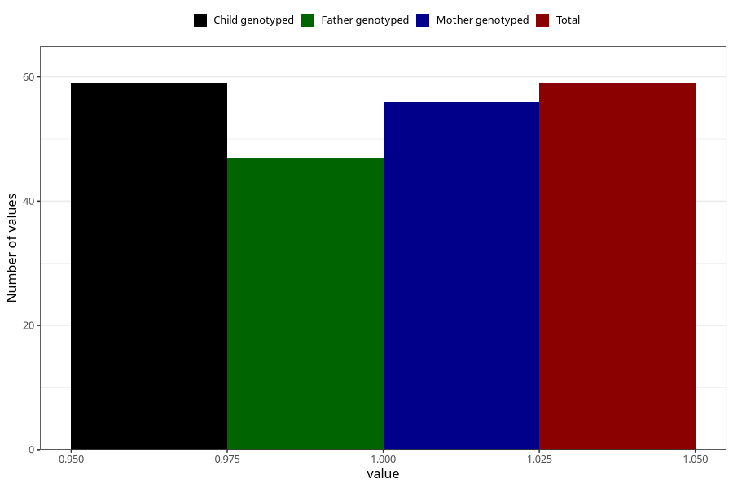

# cerebral_palsy_7y
Variable mapping to `JJ430` in `Skjema7aar_v12`.
- Number of values:

| Value | Total | Child genotyped | Mother genotyped | Father genotyped |
| ----- | ----- | --------------- | ---------------- | ---------------- |
| Missing | 80946 | 80946 | 76561 | 53557 |
| Non-missing | 59 | 59 | 56 | 47 |
| 1 | 59 | 59 | 56 | 47 |

