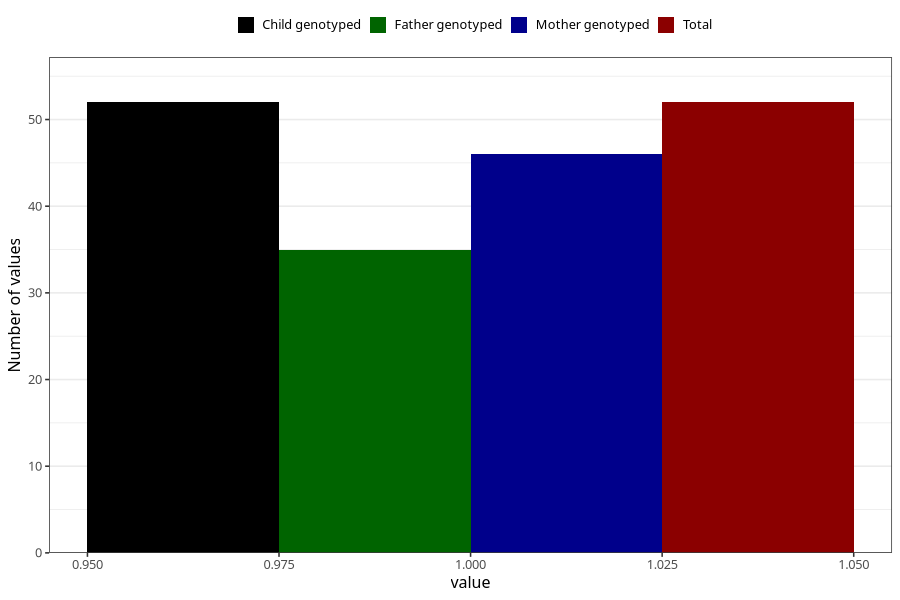

# cerebral_palsy_8y
Variable mapping to `NN33` in `Skjema8aar_v12`.
- Number of values:

| Value | Total | Child genotyped | Mother genotyped | Father genotyped |
| ----- | ----- | --------------- | ---------------- | ---------------- |
| Missing | 80953 | 80953 | 76571 | 53569 |
| Non-missing | 52 | 52 | 46 | 35 |
| 1 | 52 | 52 | 46 | 35 |

