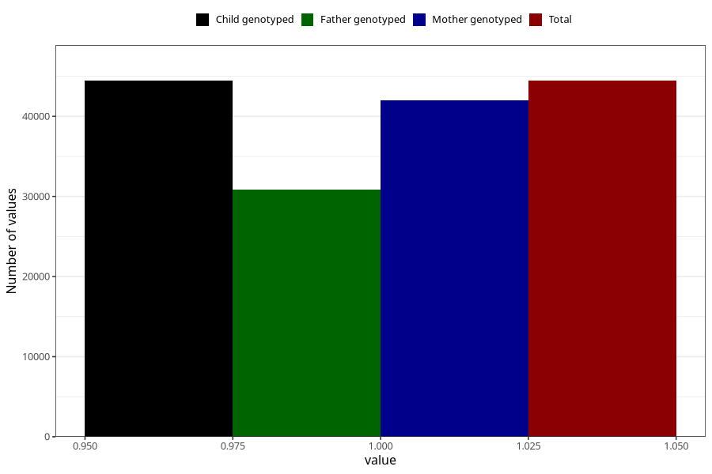

# cerebral_palsy_no_3y
Variable mapping to `GG41` in `Skjema6_3aar_v12`.
- Number of values:

| Value | Total | Child genotyped | Mother genotyped | Father genotyped |
| ----- | ----- | --------------- | ---------------- | ---------------- |
| Missing | 36566 | 36566 | 34582 | 22762 |
| Non-missing | 44439 | 44439 | 42035 | 30842 |
| 1 | 44439 | 44439 | 42035 | 30842 |

