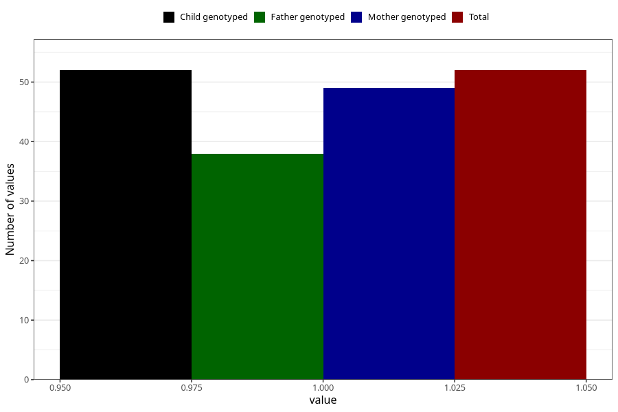

# cerebral_palsy_yes_3y
Variable mapping to `GG42` in `Skjema6_3aar_v12`.
- Number of values:

| Value | Total | Child genotyped | Mother genotyped | Father genotyped |
| ----- | ----- | --------------- | ---------------- | ---------------- |
| Missing | 80953 | 80953 | 76568 | 53566 |
| Non-missing | 52 | 52 | 49 | 38 |
| 1 | 52 | 52 | 49 | 38 |

