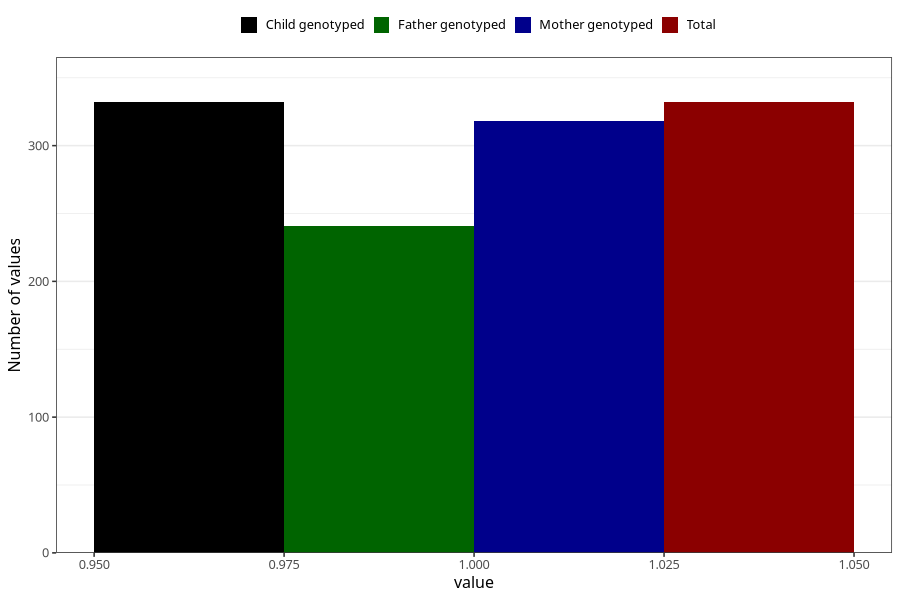

# coeliac_disease_8y
Variable mapping to `NN31` in `Skjema8aar_v12`.
- Number of values:

| Value | Total | Child genotyped | Mother genotyped | Father genotyped |
| ----- | ----- | --------------- | ---------------- | ---------------- |
| Missing | 80673 | 80673 | 76299 | 53363 |
| Non-missing | 332 | 332 | 318 | 241 |
| 1 | 332 | 332 | 318 | 241 |

