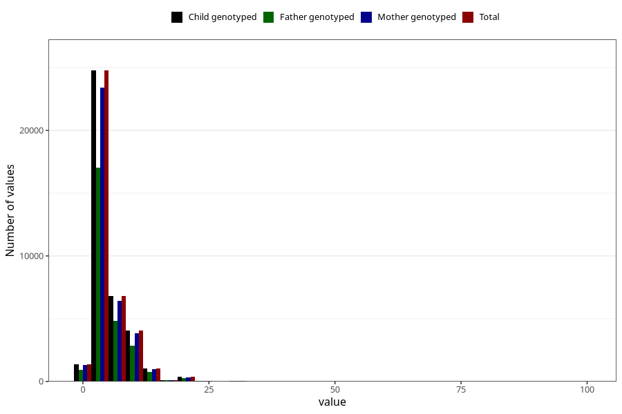

# common_cold_freq_3y
Variable mapping to `GG129` in `Skjema6_3aar_v12`.
- Number of values:

| Value | Total | Child genotyped | Mother genotyped | Father genotyped |
| ----- | ----- | --------------- | ---------------- | ---------------- |
| Missing | 42357 | 42357 | 40074 | 26794 |
| Non-missing | 38648 | 38648 | 36543 | 26810 |
| 25th percentile | 3 | 3 | 3 | 3 |
| 50th percentile | 4 | 4 | 4 | 4 |
| 75th percentile | 6 | 6 | 6 | 6 |
| Mean | 5.27486545228731 | 5.27486545228731 | 5.27315764989191 | 5.31827676240209 |
| Standard deviation | 4.18232460048754 | 4.18232460048754 | 4.17590261756822 | 4.12614488292078 |
| N | 38648 | 38648 | 36543 | 26810 |

