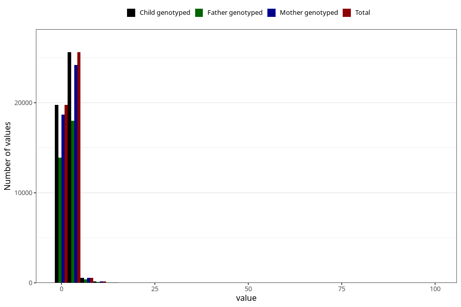

# common_cold_freq_6m
Variable mapping to `DD264` in `Skjema4_6mnd_v12`.
- Number of values:

| Value | Total | Child genotyped | Mother genotyped | Father genotyped |
| ----- | ----- | --------------- | ---------------- | ---------------- |
| Missing | 34853 | 34853 | 33004 | 21129 |
| Non-missing | 46152 | 46152 | 43613 | 32475 |
| 25th percentile | 1 | 1 | 1 | 1 |
| 50th percentile | 2 | 2 | 2 | 2 |
| 75th percentile | 2 | 2 | 2 | 2 |
| Mean | 1.97610071069509 | 1.97610071069509 | 1.97464058881526 | 1.97222478829869 |
| Standard deviation | 1.76426258208239 | 1.76426258208239 | 1.78128572229003 | 1.74025362704046 |
| N | 46152 | 46152 | 43613 | 32475 |

