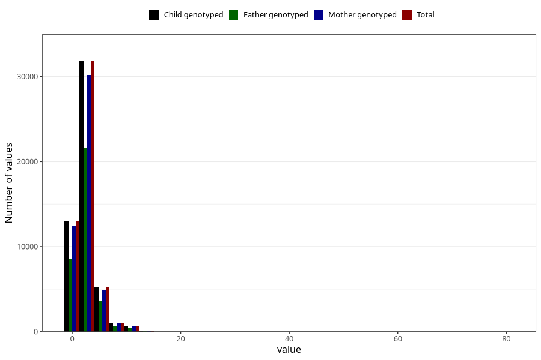

# common_cold_number_12_18m
Variable mapping to `EE218` in `Skjema5_18mnd_v12`.
- Number of values:

| Value | Total | Child genotyped | Mother genotyped | Father genotyped |
| ----- | ----- | --------------- | ---------------- | ---------------- |
| Missing | 29131 | 29131 | 27431 | 18637 |
| Non-missing | 51874 | 51874 | 49186 | 34967 |
| Filled in text or mark instead of number | 6 | 6 | 5 |5 |
| 25th percentile | 1 | 1 | 1 | 2 |
| 50th percentile | 2 | 2 | 2 | 2 |
| 75th percentile | 3 | 3 | 3 | 4 |
| Mean | 2.74820698696692 | 2.74820698696692 | 2.74697545800207 | 2.77944625593502 |
| Standard deviation | 1.91795579775102 | 1.91795579775102 | 1.90984991287237 | 1.93091924515343 |
| N | 51868 | 51868 | 49181 | 34962 |

