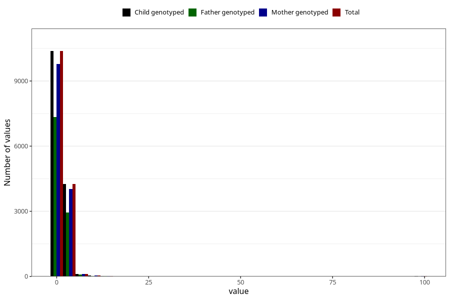

# conjunctivities_freq_6m
Variable mapping to `DD292` in `Skjema4_6mnd_v12`.
- Number of values:

| Value | Total | Child genotyped | Mother genotyped | Father genotyped |
| ----- | ----- | --------------- | ---------------- | ---------------- |
| Missing | 66157 | 66157 | 62599 | 43186 |
| Non-missing | 14848 | 14848 | 14018 | 10418 |
| 25th percentile | 1 | 1 | 1 | 1 |
| 50th percentile | 1 | 1 | 1 | 1 |
| 75th percentile | 2 | 2 | 2 | 2 |
| Mean | 1.61112607758621 | 1.61112607758621 | 1.61470965900984 | 1.58734881935112 |
| Standard deviation | 3.00118566152725 | 3.00118566152725 | 3.0575797778244 | 2.90354049905004 |
| N | 14848 | 14848 | 14018 | 10418 |

