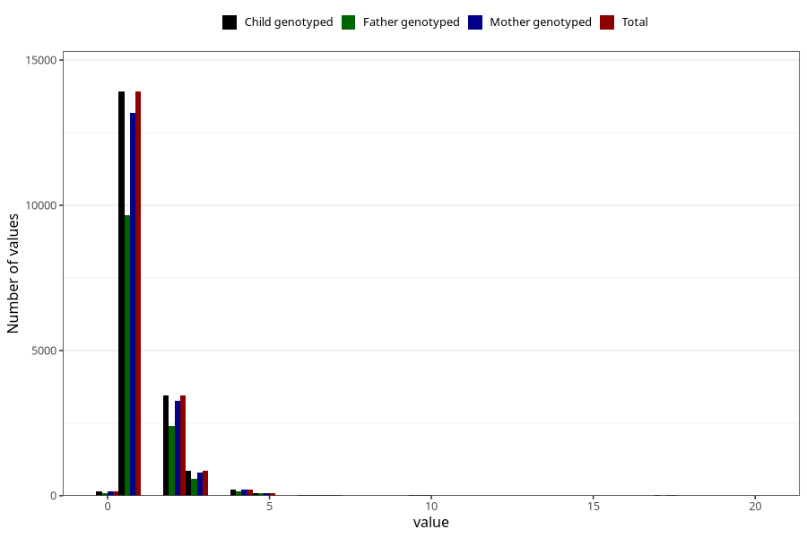

# conjunctivitis_number_12_18m
Variable mapping to `EE253` in `Skjema5_18mnd_v12`.
- Number of values:

| Value | Total | Child genotyped | Mother genotyped | Father genotyped |
| ----- | ----- | --------------- | ---------------- | ---------------- |
| Missing | 62204 | 62204 | 58786 | 40534 |
| Non-missing | 18801 | 18801 | 17831 | 13070 |
| Filled in text or mark instead of number | 1 | 1 | 1 |0 |
| 25th percentile | 1 | 1 | 1 | 1 |
| 50th percentile | 1 | 1 | 1 | 1 |
| 75th percentile | 2 | 2 | 2 | 2 |
| Mean | 1.3875 | 1.3875 | 1.38900729108245 | 1.39211935730681 |
| Standard deviation | 1.0746403988348 | 1.0746403988348 | 1.07828742233266 | 1.10388501030886 |
| N | 18800 | 18800 | 17830 | 13070 |

