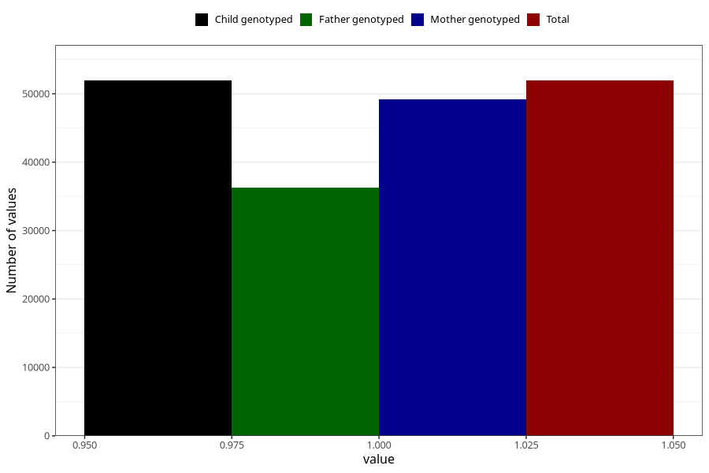

# delayed_motor_development_no_18m
Variable mapping to `EE799` in `Skjema5_18mnd_v12`.
- Number of values:

| Value | Total | Child genotyped | Mother genotyped | Father genotyped |
| ----- | ----- | --------------- | ---------------- | ---------------- |
| Missing | 29078 | 29078 | 27481 | 17376 |
| Non-missing | 51927 | 51927 | 49136 | 36228 |
| 1 | 51927 | 51927 | 49136 | 36228 |

