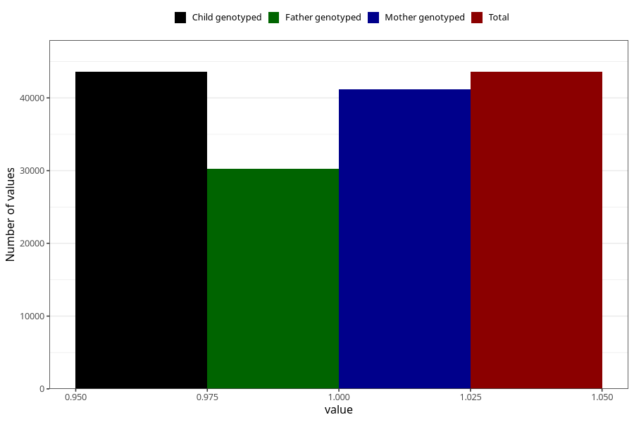

# delayed_motor_development_no_3y
Variable mapping to `GG37` in `Skjema6_3aar_v12`.
- Number of values:

| Value | Total | Child genotyped | Mother genotyped | Father genotyped |
| ----- | ----- | --------------- | ---------------- | ---------------- |
| Missing | 37429 | 37429 | 35403 | 23340 |
| Non-missing | 43576 | 43576 | 41214 | 30264 |
| 1 | 43576 | 43576 | 41214 | 30264 |

