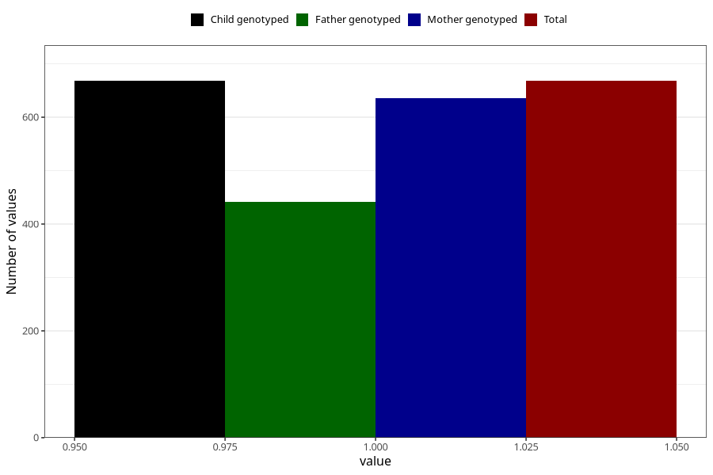

# delayed_motor_development_previous_3y
Variable mapping to `GG39` in `Skjema6_3aar_v12`.
- Number of values:

| Value | Total | Child genotyped | Mother genotyped | Father genotyped |
| ----- | ----- | --------------- | ---------------- | ---------------- |
| Missing | 80337 | 80337 | 75981 | 53162 |
| Non-missing | 668 | 668 | 636 | 442 |
| 1 | 668 | 668 | 636 | 442 |

