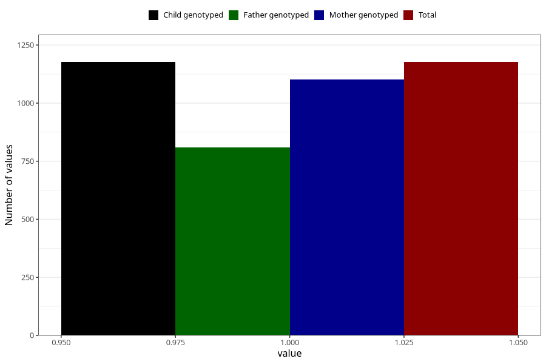

# delayed_motor_development_previously_18m
Variable mapping to `EE801` in `Skjema5_18mnd_v12`.
- Number of values:

| Value | Total | Child genotyped | Mother genotyped | Father genotyped |
| ----- | ----- | --------------- | ---------------- | ---------------- |
| Missing | 79828 | 79828 | 75514 | 52795 |
| Non-missing | 1177 | 1177 | 1103 | 809 |
| 1 | 1177 | 1177 | 1103 | 809 |

