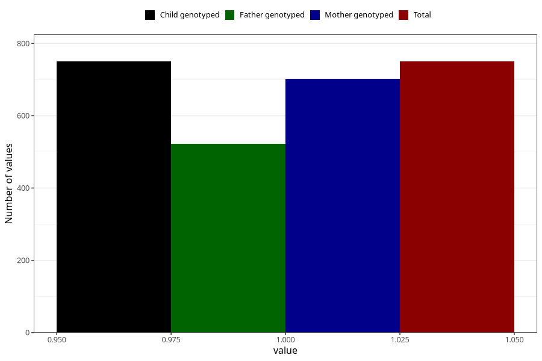

# delayed_motor_development_yes_18m
Variable mapping to `EE800` in `Skjema5_18mnd_v12`.
- Number of values:

| Value | Total | Child genotyped | Mother genotyped | Father genotyped |
| ----- | ----- | --------------- | ---------------- | ---------------- |
| Missing | 80255 | 80255 | 75915 | 53081 |
| Non-missing | 750 | 750 | 702 | 523 |
| 1 | 750 | 750 | 702 | 523 |

