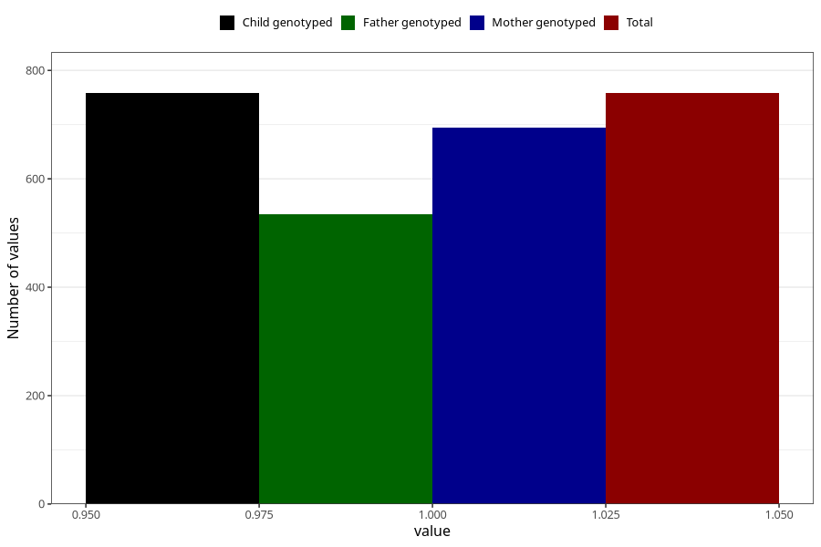

# delayed_or_abnormal_language_development_currently_8y
Variable mapping to `NN41` in `Skjema8aar_v12`.
- Number of values:

| Value | Total | Child genotyped | Mother genotyped | Father genotyped |
| ----- | ----- | --------------- | ---------------- | ---------------- |
| Missing | 80247 | 80247 | 75922 | 53070 |
| Non-missing | 758 | 758 | 695 | 534 |
| 1 | 758 | 758 | 695 | 534 |

