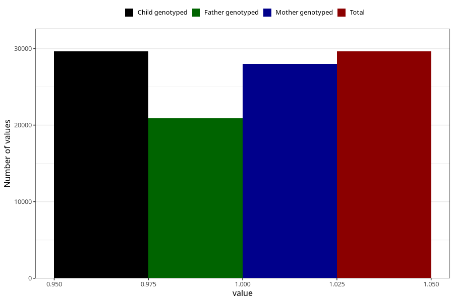

# delayed_or_abnormal_language_development_no_8y
Variable mapping to `NN40` in `Skjema8aar_v12`.
- Number of values:

| Value | Total | Child genotyped | Mother genotyped | Father genotyped |
| ----- | ----- | --------------- | ---------------- | ---------------- |
| Missing | 51382 | 51382 | 48615 | 32730 |
| Non-missing | 29623 | 29623 | 28002 | 20874 |
| 1 | 29623 | 29623 | 28002 | 20874 |

