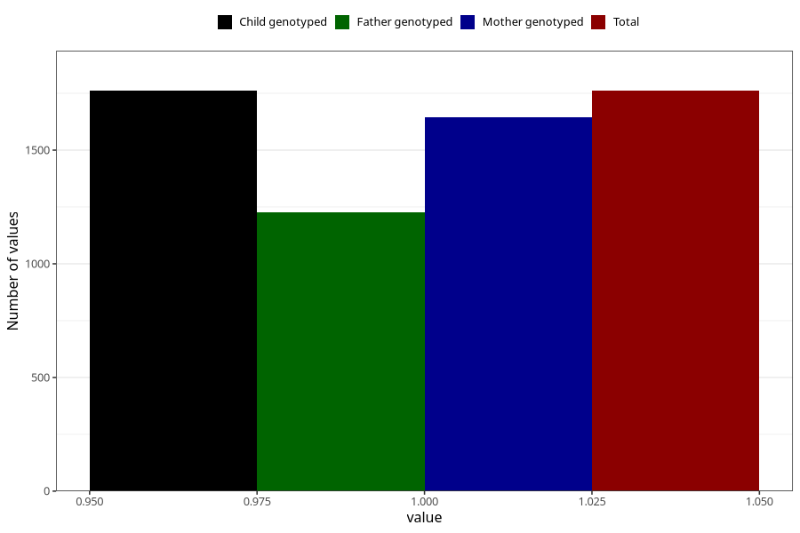

# delayed_or_abnormal_language_development_past_8y
Variable mapping to `NN42` in `Skjema8aar_v12`.
- Number of values:

| Value | Total | Child genotyped | Mother genotyped | Father genotyped |
| ----- | ----- | --------------- | ---------------- | ---------------- |
| Missing | 79244 | 79244 | 74972 | 52379 |
| Non-missing | 1761 | 1761 | 1645 | 1225 |
| 1 | 1761 | 1761 | 1645 | 1225 |

