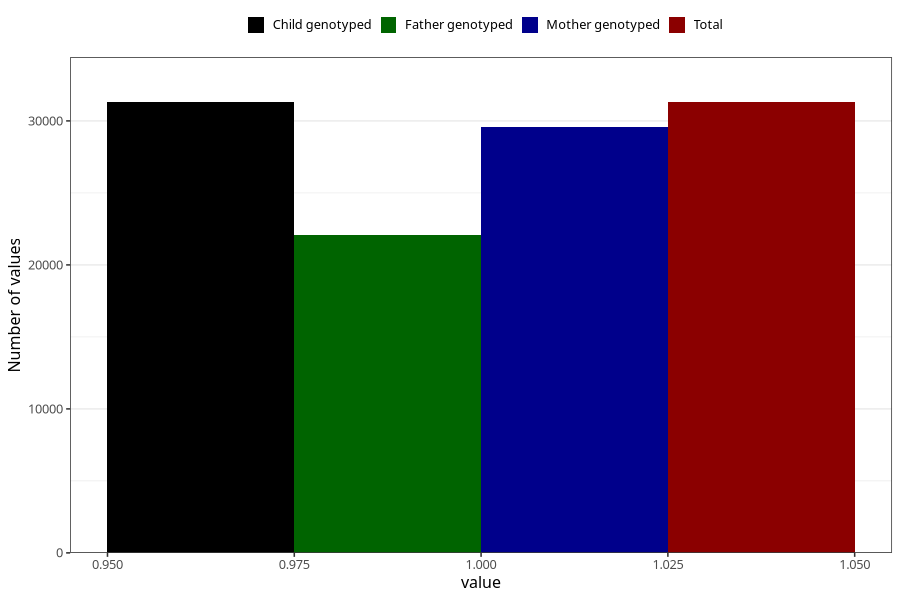

# delayed_psychomotor_development_no_8y
Variable mapping to `NN36` in `Skjema8aar_v12`.
- Number of values:

| Value | Total | Child genotyped | Mother genotyped | Father genotyped |
| ----- | ----- | --------------- | ---------------- | ---------------- |
| Missing | 49705 | 49705 | 47052 | 31561 |
| Non-missing | 31300 | 31300 | 29565 | 22043 |
| 1 | 31300 | 31300 | 29565 | 22043 |

