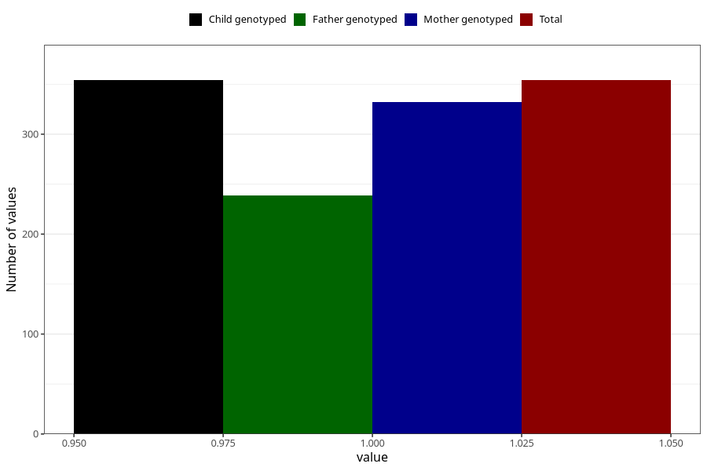

# delayed_psychomotor_development_past_8y
Variable mapping to `NN38` in `Skjema8aar_v12`.
- Number of values:

| Value | Total | Child genotyped | Mother genotyped | Father genotyped |
| ----- | ----- | --------------- | ---------------- | ---------------- |
| Missing | 80651 | 80651 | 76285 | 53365 |
| Non-missing | 354 | 354 | 332 | 239 |
| 1 | 354 | 354 | 332 | 239 |

